# izhubs ERP — Stitch UI Mockups (2026-03-25)

> **Stitch Project ID**: `2420013479080174207`
> **Stitch URL**: https://stitch.withgoogle.com/projects/2420013479080174207
> **Design System**: "Indigo Prism Executive" — Dark glassmorphism, Inter font, compact data-dense
> **Feng Shui**: Gold/champagne (#D4A76A) — mệnh Kim (Metal), 1993 Quý Dậu
> **Device**: Desktop PC (2560x2048)

---

## 📊 Tổng kết Audit

- **47 page routes** hiện có trong codebase
- **13 screens mới** đã tạo trên Stitch (bao gồm 3 bước Campaign Wizard + 2 trạng thái OAuth)
- Tất cả dùng dark glassmorphism theme, compact spacing (12px padding, 8px gaps, 36px table rows)

---

## 🖥️ Screenshots

### 1. CEO Executive Dashboard
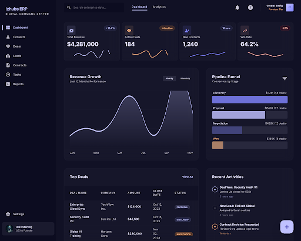
- 4 KPI cards (Revenue, Active Deals, New Contacts, Win Rate) với sparklines
- Revenue area chart 12 tháng + Pipeline funnel
- Top Deals table + Recent Activity timeline

### 2. Marketing Dashboard
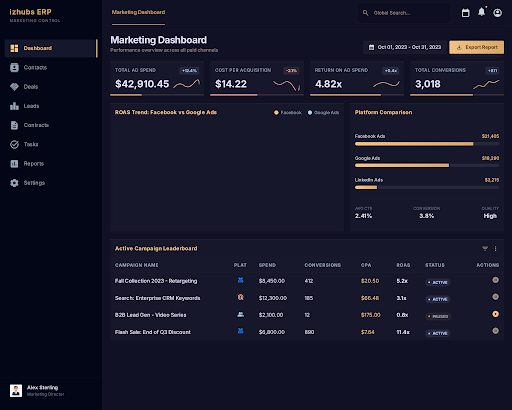
- Ad Spend, CPA, ROAS, Conversions KPIs
- ROAS chart FB vs GG, Platform comparison
- Campaign Leaderboard table với Pause/Resume actions

### 3. Contact Detail
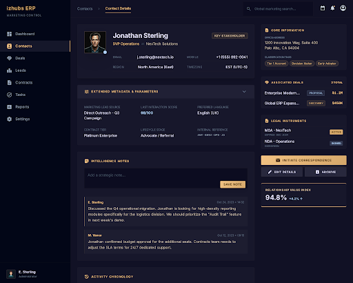
- Inline property list, Notes, Activity timeline
- Related Deals, Contracts, Quick Actions sidebar

### 4. Deal Detail
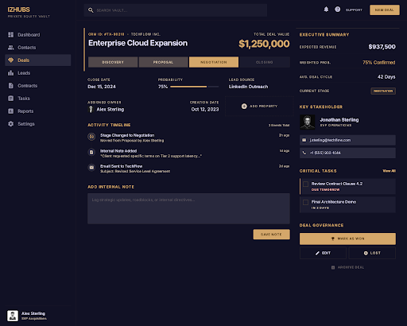
- Stage progress bar, Deal value, Probability
- Activity timeline, Notes section
- Contact card, Tasks, Quick Actions sidebar

### 5. Notification Center
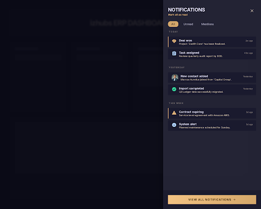
- Slide-out panel 480px, filter tabs (All/Unread/Mentions)
- Grouped by time, unread dot indicators

### 6. Forgot Password
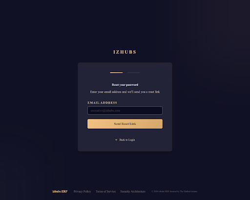
- 2-step flow: email entry → success confirmation
- Centered card layout, clean auth design

### 7. Settings > Profile
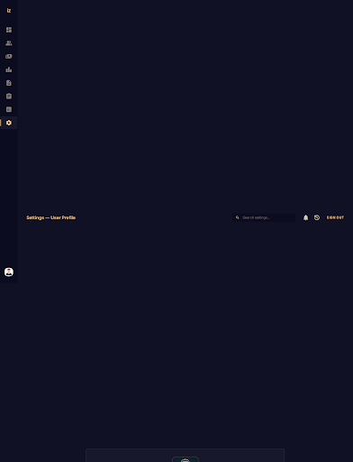
- Profile photo + basic info, Password & Security
- Preferences (language, timezone, theme, notifications)
- Danger Zone (delete account)

### 8. Auto-Synced Ad Expenses Approval
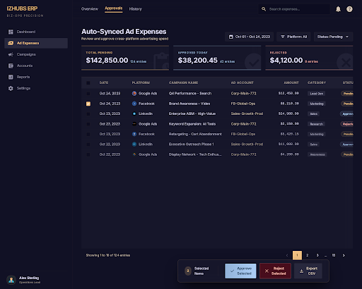
- Filter bar (date, platform, status)
- Summary banner (Pending, Approved, Rejected)
- Data table với bulk approve/reject actions

### 9-11. Campaign Creation Wizard (3 Steps)
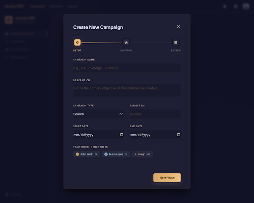
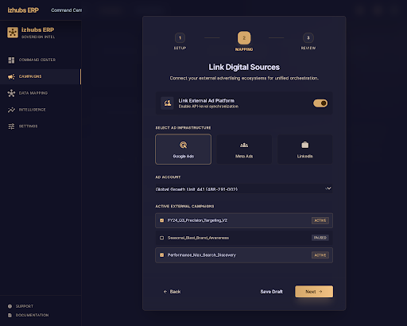
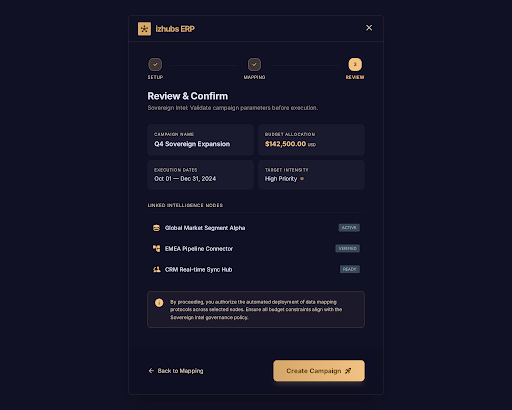
- Step 1: Campaign details (name, type, budget, team)
- Step 2: Digital source mapping (platform, ad account, campaigns)
- Step 3: Review & Create

### 12-13. OAuth Callback (Sync Progress)
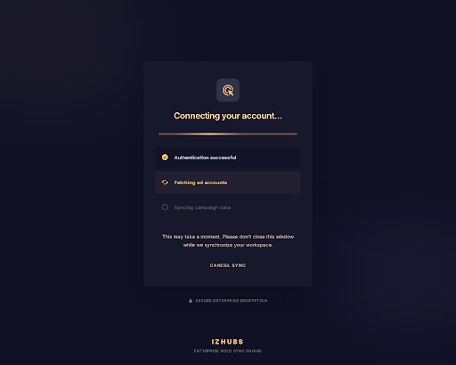
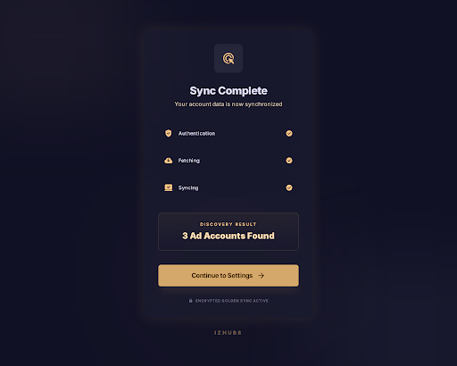
- Loading state: stepped progress (Auth → Fetch → Sync)
- Success state: "X Ad Accounts Found" → Continue

---

## 🎨 Design System Tokens

| Token | Value |
|-------|-------|
| Background | `#111125` |
| Cards | `#1a1a2e` |
| Surface High | `#28283d` |
| Primary | `#c0c1ff` (indigo) |
| Feng Shui Accent | `#D4A76A` (gold) |
| Tertiary | `#ffb783` (amber) |
| Error | `#ffb4ab` |
| Text | `#e2e0fc` / `#c7c4d7` |
| Font | Inter 400/500/600 |
| Radius | 4-8px |
| Spacing | 8-12px |

---

## 📋 Implementation Priority

1. **Contact Detail** & **Deal Detail** — core CRM pages users interact with daily
2. **Notification Center** — engagement/retention driver
3. **Settings Profile** — essential user management
4. **Forgot Password** — auth flow completeness
5. **Marketing Dashboard** — Biz-Ops Digital Sync landing page
6. **Auto-Expenses Approval** — finance reconciliation
7. **Campaign Wizard** — improved creation UX
8. **OAuth Callback** — trust-building sync flow
9. **CEO Dashboard** — executive overview (after role-based routing)
